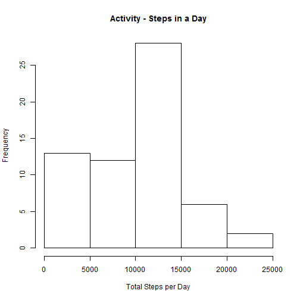
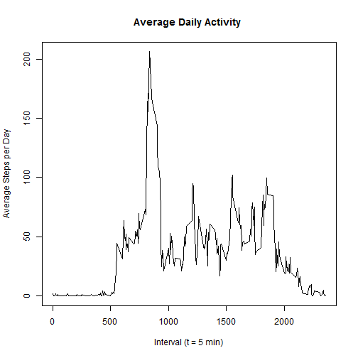
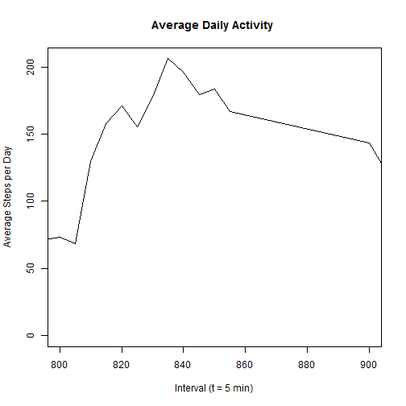
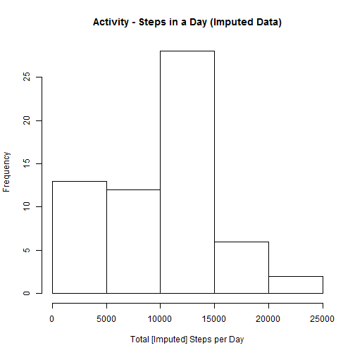
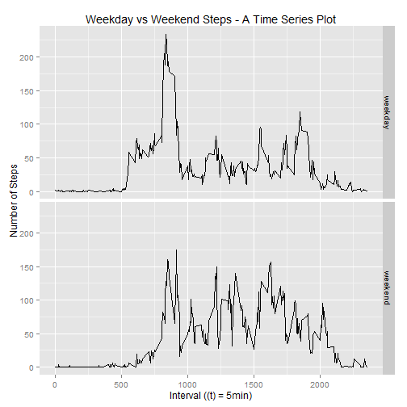

Reproducible Research - Project 1
=================================
Establish global options and libraries

```r
library(knitr)
time <- format(Sys.time(), "%a %b %d %X %Y")
opts_chunk$set(echo=TRUE, results = "show", warning = FALSE, message = FALSE)
```

```r
library(dplyr)
library(ggplot2)
library(lubridate)
```


```r
#check to see if the file exists and if not then get it
if(!file.exists("activity.csv")){ 
    tempdata<-tempfile() 
    download.file("https://d396qusza40orc.cloudfront.net/repdata%2Fdata%2Factivity.zip", tempdata) 
    activity_data <- unzip(tempdata) 
    unlink(tempdata) 
} else 
    if(file.exists("activity.csv")){
        df1 <- read.csv("activity.csv", na.strings = c('NA', '<NA>'))
    } else stop("You haven't followed the instructions and extracted the raw data and the code
                  to the same working directory. Please start over.")
```
##What is the mean number of steps taken in a day
####The average is ~ 9354 steps in a day

```r
dfg <- group_by(df1, date) 
dfs <- summarise(dfg, total=sum(steps, na.rm = TRUE)) 
hist(dfs$total,breaks = 4, main = "Activity - Steps in a Day",
     ylab = "Frequency", xlab = "Total Steps per Day")
```

 

```r
dfs.2 <- summarise(dfs, avg=mean(total, na.rm = TRUE), med=median(total))
print(dfs.2)
```

```
## Source: local data frame [1 x 2]
## 
##       avg   med
##     (dbl) (int)
## 1 9354.23 10395
```

##Which 5-minute interval contains the maximum number of steps
####The max interval appears to be ~ 835

```r
dfg.1 <- group_by(dfg, interval)
dfs.3 <- summarise(dfg.1, avg=mean(steps, na.rm = TRUE))
plot(dfs.3$interval, dfs.3$avg, type = 'l', main = "Average Daily Activity ", xlab = "Interval (t = 5 min)", ylab = "Average Steps per Day")
```

 

```r
plot(dfs.3$interval, dfs.3$avg, type = 'l', main = "Average Daily Activity ", xlab = "Interval (t = 5 min)", ylab = "Average Steps per Day", xlim = c(800, 900))
```

 

##Imputing Missing Values
####The values were essentially the same

```r
#Impute missing values by merging NAs with the calculated means
#of each day (as grouped). We summarise the steps and arrive at
#a simple arithmetic mean, then we base::merge df1 w/ df1.2 keeping
#all x-observations. Then we mutate df1.3 and impute all of the NA
#values with the mean observations previous calculated. 
df1.1 <- group_by(df1, date)
df1.2 <- summarise(df1.1, avg = mean(steps, na.rm = TRUE))
df1.3 <- merge(df1, df1.2, all.x = TRUE)
df1.4 <- mutate(df1.3, steps = ifelse(is.na(steps)==TRUE, avg, steps))
df1.5 <- group_by(df1.4, date)
df1.6 <- summarise(df1.5, total=sum(steps, na.rm = TRUE)) 
hist(df1.6$total,breaks = 4, main = "Activity - Steps in a Day (Imputed Data)",
     ylab = "Frequency", xlab = "Total [Imputed] Steps per Day")
```

 

```r
dfs2.1 <- summarise(df1.6, avg=mean(total, na.rm = TRUE), med=median(total))
print(dfs2.1)
```

```
## Source: local data frame [1 x 2]
## 
##       avg   med
##     (dbl) (dbl)
## 1 9354.23 10395
```
##Differences between weekend and weekday steps
####Step values increased during 1000-1700 intervals

```r
dayType <- c('Monday', 'Tuesday', 'Wednesday', 'Thursday', 'Friday') 
df1.4$dayType <- factor((ifelse(weekdays(as.Date(df1.4$date)) %in% dayType,'weekday', 'weekend'))) 
df1.4.grouped <- group_by(df1.4, interval, dayType) 
df1.4.summarised <- summarise(df1.4.grouped, avgInt = mean(steps, na.rm = TRUE))
qplot(interval, avgInt, data = df1.4.summarised, geom = 'line', facets = dayType ~ ., 
      main = "Weekday vs Weekend Steps - A Time Series Plot", xlab = "Interval ((t) = 5min)",
      ylab = "Number of Steps")
```

 

This HTML markdown file was generated: Tue Sep 08 07:58:17 PM 2015.
